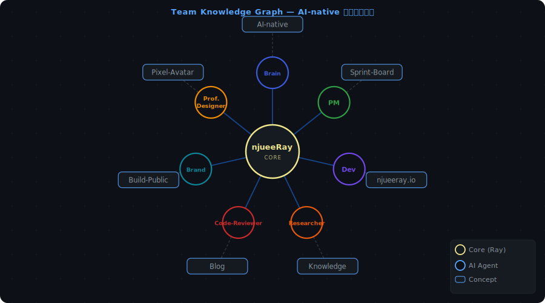

<!-- ===== HEADER ===== -->
<picture>
  <source media="(prefers-color-scheme: dark)" srcset="https://capsule-render.vercel.app/api?type=waving&color=0:0d1117,100:1a1b27&height=200&section=header&text=njueeRay&fontSize=60&fontColor=58a6ff&animation=twinkling&fontAlignY=35&desc=LLM%20Engineer%20%C2%B7%20AI-Native%20%C2%B7%20Building%20in%20Public&descSize=17&descColor=8b949e&descAlignY=63" />
  
</picture>

<!-- ===== TYPING SVG: 个人身份标签 ===== -->
<div align="center">

[](https://readme-typing-svg.demolab.com)

</div>

---

<!-- ===== JSON 自述（10+ 字段 + 叙事段）===== -->
```json
{
  "name"         : "Ray Huang",
  "location"     : "Nanjing, China 🇨🇳",
  "education"    : "Nanjing University · Electronic Science & Engineering",
  "role"         : ["LLM Engineer", "Open Source Programmer", "Full-Stack Dev"],
  "focus"        : "Exploring the best AI-Native development practices",
  "llm_stack"    : ["LangChain", "LlamaIndex", "OpenAI API", "HuggingFace"],
  "languages"    : ["Python", "C++", "TypeScript", "JavaScript"],
  "current_proj" : ["OpenProfile", "njueeray.github.io", "wechat_article_exporter"],
  "open_to"      : "AI tooling · open source collaboration · LLM applications",
  "motto"        : "Future is coming, move early.",
  "status"       : "Building in public 🔨",
  "fun_fact"     : "I let AI agents plan, write, and review — I just ship."
}
```

> I'm a builder at the intersection of LLM engineering and open source.
> Currently exploring AI-Native development — where agents aren't just coding assistants,
> but autonomous team members that plan, implement, and review together with humans.
> Every project I ship is a live experiment in human–AI collaboration.

<!-- ===== AI 协作团队 ===== -->
## 🤖 My AI Team

<div align="center">

<a href="https://njueeray.github.io/agents">
<picture>
  <source media="(prefers-color-scheme: dark)" srcset="https://raw.githubusercontent.com/njueeRay/njueeRay/main/assets/agent-pixel-badge-dark.svg" />
  
</picture>
</a>

7 specialized AI agents — planning, implementing, reviewing and shipping together with me.

[](https://njueeray.github.io/agents)
&nbsp;&nbsp;
[](https://njueeray.github.io/agents/office)
&nbsp;&nbsp;
[](https://njueeray.github.io/agents/graph)

</div>

<!-- ===== 渐变分隔线 ===== -->
<picture>
  <source media="(prefers-color-scheme: dark)" srcset="https://capsule-render.vercel.app/api?type=soft&color=0:0d1117,50:1a2744,100:0d1117&height=4&section=header" />
  
</picture>

## ⚡ Tech Stack

<div align="center">

<picture>
  <source media="(prefers-color-scheme: dark)" srcset="https://skillicons.dev/icons?i=py,cpp,ts,js,react,nodejs,nextjs,docker,git,linux,tailwind,pytorch,fastapi,postgres,redis,vscode,github,bash,astro,vite&theme=dark&perline=10" />
  
</picture>

</div>

## 📊 GitHub Stats

<div align="center">

<table><tr><td>
<picture>
  <source media="(prefers-color-scheme: dark)" srcset="https://github-readme-stats.vercel.app/api?username=njueeRay&theme=github_dark_dimmed&hide_border=true&show_icons=true&include_all_commits=true&count_private=true" />
  
</picture>
</td><td>
<picture>
  <source media="(prefers-color-scheme: dark)" srcset="https://streak-stats.demolab.com/?user=njueeRay&theme=github-dark-blue&hide_border=true" />
  
</picture>
</td></tr></table>

</div>

## 📈 Activity Graph

<div align="center">

<picture>
  <source media="(prefers-color-scheme: dark)" srcset="https://github-readme-activity-graph.vercel.app/graph?username=njueeRay&theme=github-compact&hide_border=true&area=true&custom_title=Contribution%20Activity" />
  
</picture>

</div>

<!-- ===== 渐变分隔线 ===== -->
<picture>
  <source media="(prefers-color-scheme: dark)" srcset="https://capsule-render.vercel.app/api?type=soft&color=0:0d1117,50:1a2744,100:0d1117&height=4&section=header" />
  
</picture>

## ⏱️ WakaTime

<details>
<summary>📊 This Week's Coding Activity</summary>
<br>

<!--START_SECTION:waka-->


**🐱 My GitHub Data** 

> 📦 141.9 kB Used in GitHub's Storage 
 > 
> 🏆 304 Contributions in the Year 2026
 > 
> 🚫 Not Opted to Hire
 > 
> 📜 29 Public Repositories 
 > 
> 🔑 2 Private Repositories 
 > 
**I'm a Night 🦉** 

```text
🌞 Morning                50 commits          ██░░░░░░░░░░░░░░░░░░░░░░░   07.90 % 
🌆 Daytime                200 commits         ████████░░░░░░░░░░░░░░░░░   31.60 % 
🌃 Evening                244 commits         ██████████░░░░░░░░░░░░░░░   38.55 % 
🌙 Night                  139 commits         █████░░░░░░░░░░░░░░░░░░░░   21.96 % 
```
📅 **I'm Most Productive on Sunday** 

```text
Monday                   44 commits          ██░░░░░░░░░░░░░░░░░░░░░░░   06.95 % 
Tuesday                  97 commits          ████░░░░░░░░░░░░░░░░░░░░░   15.32 % 
Wednesday                102 commits         ████░░░░░░░░░░░░░░░░░░░░░   16.11 % 
Thursday                 102 commits         ████░░░░░░░░░░░░░░░░░░░░░   16.11 % 
Friday                   115 commits         █████░░░░░░░░░░░░░░░░░░░░   18.17 % 
Saturday                 49 commits          ██░░░░░░░░░░░░░░░░░░░░░░░   07.74 % 
Sunday                   124 commits         █████░░░░░░░░░░░░░░░░░░░░   19.59 % 
```


📊 **This Week I Spent My Time On** 

```text
🕑︎ Time Zone: Asia/Shanghai

💬 Programming Languages: 
C++                      55 mins             ███████░░░░░░░░░░░░░░░░░░   27.94 % 
Markdown                 52 mins             ███████░░░░░░░░░░░░░░░░░░   26.38 % 
Other                    40 mins             █████░░░░░░░░░░░░░░░░░░░░   20.22 % 
Python                   30 mins             ████░░░░░░░░░░░░░░░░░░░░░   15.21 % 
Bash                     14 mins             ██░░░░░░░░░░░░░░░░░░░░░░░   07.20 % 

🔥 Editors: 
VS Code                  3 hrs 19 mins       █████████████████████████   100.00 % 

🐱‍💻 Projects: 
go_gen3_verification     1 hr 36 mins        ████████████░░░░░░░░░░░░░   48.14 % 
npu_model                1 hr 10 mins        █████████░░░░░░░░░░░░░░░░   35.46 % 
npu3_model               16 mins             ██░░░░░░░░░░░░░░░░░░░░░░░   08.19 % 
MediaCrawler             14 mins             ██░░░░░░░░░░░░░░░░░░░░░░░   07.20 % 
ssh                      2 mins              ░░░░░░░░░░░░░░░░░░░░░░░░░   01.01 % 

💻 Operating System: 
Linux                    2 hrs 10 mins       ████████████████░░░░░░░░░   65.45 % 
Windows                  1 hr 9 mins         █████████░░░░░░░░░░░░░░░░   34.55 % 
```

**I Mostly Code in Python** 

```text
Python                   5 repos             ██████░░░░░░░░░░░░░░░░░░░   25.00 % 
TypeScript               5 repos             ██████░░░░░░░░░░░░░░░░░░░   25.00 % 
PowerShell               2 repos             ██░░░░░░░░░░░░░░░░░░░░░░░   10.00 % 
JavaScript               2 repos             ██░░░░░░░░░░░░░░░░░░░░░░░   10.00 % 
Astro                    1 repo              █░░░░░░░░░░░░░░░░░░░░░░░░   05.00 % 
```


**Timeline**


 Last Updated on 27/03/2026 19:23:32 UTC
<!--END_SECTION:waka-->

<!-- Fallback: 如数据为空，请确认已在 WakaTime → Settings 中开启 "Share coding activity publicly" -->

</details>

## 🐍 Contribution Snake

<div align="center">

<picture>
  <source media="(prefers-color-scheme: dark)" srcset="https://raw.githubusercontent.com/njueeRay/njueeRay/output/github-contribution-grid-snake-dark.svg" />
  
</picture>

</div>

<!-- ===== 渐变分隔线 ===== -->
<picture>
  <source media="(prefers-color-scheme: dark)" srcset="https://capsule-render.vercel.app/api?type=soft&color=0:0d1117,50:1a2744,100:0d1117&height=4&section=header" />
  
</picture>

## 🏆 Achievements

<div align="center">

[](https://github.com/njueeRay?tab=repositories)
[](https://github.com/njueeRay?tab=followers)
[](https://github.com/njueeRay/OpenProfile)
[](https://github.com/njueeRay/MediaCrawler)
[](https://github.com/njueeRay/wechat_article_exporter)

[](https://github.com/njueeRay/njueeray.github.io/actions/workflows/e2e.yml)
[](https://github.com/njueeRay/njueeray.github.io/actions/workflows/deploy.yml)
[](https://astro.build)
[](https://playwright.dev)

</div>

<details>
<summary>🌏 3D Contribution Graph</summary>
<br>
<div align="center">

<picture>
  <source media="(prefers-color-scheme: dark)" srcset="https://raw.githubusercontent.com/njueeRay/njueeRay/main/profile-3d-contrib/profile-night-rainbow.svg" />
  
</picture>

</div>
</details>

<!-- ===== TEAM KNOWLEDGE GRAPH ===== -->
<details>
<summary>🧠 Team Knowledge Graph — AI-native 团队认知图谱</summary>
<br/>
<div align="center">
  
</div>
</details>

<!-- ===== 渐变分隔线 ===== -->
<picture>
  <source media="(prefers-color-scheme: dark)" srcset="https://capsule-render.vercel.app/api?type=soft&color=0:0d1117,50:1a2744,100:0d1117&height=4&section=header" />
  
</picture>

## 🚀 Featured Projects

<div align="center">

| [🌐 njueeray.github.io](https://njueeray.github.io) | [🤖 OpenProfile](https://github.com/njueeRay/OpenProfile) | [🔍 wechat\_article\_exporter](https://github.com/njueeRay/wechat_article_exporter) |
|:---:|:---:|:---:|
| AI-native portfolio — Agent personas, knowledge graph & workflow guide | AI-Native Profile workflow — build yours with Copilot Agents | 微信公众号爬虫系统 |
| [](https://njueeray.github.io) [](https://njueeray.github.io/agents) |    |    |

</div>

<!-- ===== 渐变分隔线 ===== -->
<picture>
  <source media="(prefers-color-scheme: dark)" srcset="https://capsule-render.vercel.app/api?type=soft&color=0:0d1117,50:1a2744,100:0d1117&height=4&section=header" />
  
</picture>

<!-- ===== HOW I BUILD ===== -->
## 🛠️ How I Build

<div align="center">

> AI-native isn't a tool setting — it's a working pattern.

| 🔁 **Recall** | ⚡ **Execute** | 🚢 **Ship** |
|:---:|:---:|:---:|
| Read Sprint Board · sync context · confirm direction | Agent roles drive implementation · Ray reviews decisions | Release created · board cleared · loop restarts |
| `~ 5 min` | `30 min – 2 hr` | `< 10 min` |

**Every feature follows this loop.** 7 specialized AI agents collaborate — Brain coordinates strategy, PM tracks progress, Dev implements, Researcher informs decisions, Code Reviewer guards quality, Profile Designer owns visuals, Brand handles storytelling.

[](https://njueeray.github.io/how-we-work)

</div>

<!-- ===== 渐变分隔线 ===== -->
<picture>
  <source media="(prefers-color-scheme: dark)" srcset="https://capsule-render.vercel.app/api?type=soft&color=0:0d1117,50:1a2744,100:0d1117&height=4&section=header" />
  
</picture>

## 📝 Latest Blog Posts

<!-- BLOG-POSTS:START -->- [用 2 分钟了解这个项目：当一个开发者让 AI 团队帮他构建自己的数字世界](https://njueeray.github.io/blog/2-min-guide-njueeray-github-io/) — YYYY-00-DD- [OpenProfile 正式开源：如何用 AI Agent 协作构建你的 GitHub Profile](https://njueeray.github.io/blog/open-source-announcement/) — YYYY-00-DD- [我们发现自己走对了：与 GEP 的不期而遇 · 团队演进研究会 2026-03-10](https://njueeray.github.io/blog/agent-team-evolution-gep-2026-03-10/) — YYYY-00-DD- [我们的 7 个 Skills 够用吗？全体会议实录 · 2026-03-10](https://njueeray.github.io/blog/skills-scaffold-all-hands-2026-03-10/) — YYYY-00-DD- [工具层三位一体：Skills × Hooks × MCP 是怎么搭起来的](https://njueeray.github.io/blog/tool-layer-architecture-skills-hooks-mcp/) — YYYY-00-DD<!-- BLOG-POSTS:END -->

> ✨ Auto-synced daily from [njueeray.github.io](https://njueeray.github.io) via RSS · [Subscribe](https://njueeray.github.io/rss.xml)

## 🤝 Connect with Me

<div align="center">

[](https://njueeray.github.io)
&nbsp;&nbsp;
[](https://njueeray.github.io/agents)
&nbsp;&nbsp;
[](https://github.com/njueeRay)
&nbsp;&nbsp;
[](https://github.com/njueeRay/OpenProfile)
&nbsp;&nbsp;
[](https://njueeray.github.io/rss.xml)

</div>

<!-- ===== FOOTER ===== -->
<picture>
  <source media="(prefers-color-scheme: dark)" srcset="https://capsule-render.vercel.app/api?type=waving&color=0:1a1b27,100:0d1117&height=100&section=footer" />
  
</picture>

<div align="center">


</div>
